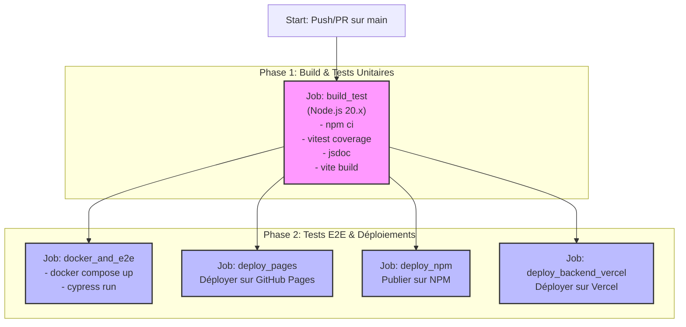

# 📝 Formulaire d'Inscription Avancé – CI/CD & Déploiement

[](https://github.com/EnzoCasalini/integ-deploiement/actions/workflows/build_test_deploy_react.yml)
[](https://app.codecov.io/gh/EnzoCasalini/integ-deploiement)
[](https://badge.fury.io/js/ci-cd-enzo-casalini)
[](https://enzocasalini.github.io/integ-deploiement/)

Ce projet est une démonstration complète d'une application web moderne, intégrant un frontend **React**, un backend **FastAPI**, des tests end-to-end avec **Cypress**, et une pipeline **CI/CD** complète avec GitHub Actions pour le déploiement et la publication.

---

###  डेमो en Ligne

🚀 **Accédez à l'application déployée ici :** [**https://enzocasalini.github.io/integ-deploiement/**](https://enzocasalini.github.io/integ-deploiement/)

*(L'API backend est hébergée sur Vercel et la base de données sur AlwaysData.)*

---

## 🌟 Fonctionnalités Clés

-   **Formulaire d'inscription complet** avec validation en temps réel.
-   **Backend RESTful** pour la gestion des utilisateurs (création, lecture, suppression).
-   **Authentification administrateur** sécurisée avec JWT.
-   **Base de données MySQL** persistante.
-   **Tests unitaires, d'intégration et E2E** pour garantir la qualité du code.
-   **Pipeline CI/CD automatisée** pour les tests, le build, et les déploiements.
-   **Publication automatique** sur NPM.
-   **Déploiement du frontend** sur GitHub Pages et du **backend** sur Vercel.

## 🛠️ Stack Technique

| Domaine      | Outil                                                                                                   | Rôle                                 |
| :----------- | :------------------------------------------------------------------------------------------------------ | :----------------------------------- |
| **Frontend** | [**React**](https://react.dev/) / [**Vite**](https://vitejs.dev/)                                         | Interface utilisateur et build       |
| **Backend**  | [**FastAPI**](https://fastapi.tiangolo.com/)                                                            | API RESTful en Python                |
| **Base de Données** | [**MySQL**](https://www.mysql.com/)                                                                     | Stockage des données des utilisateurs |
| **Tests**    | [**Vitest**](https://vitest.dev/) / [**Cypress**](https://www.cypress.io/)                                | Tests unitaires, intégration et E2E  |
| **CI/CD**    | [**GitHub Actions**](https://github.com/features/actions) / [**Docker**](https://www.docker.com/)         | Automatisation et conteneurisation   |
| **Hébergement** | [**GitHub Pages**](https://pages.github.com/) / [**Vercel**](https://vercel.com/) / [**AlwaysData**](https://www.alwaysdata.com/) | Déploiement Front, Back et BDD       |
| **Qualité**  | [**ESLint**](https://eslint.org/) / [**Codecov**](https://about.codecov.io/)                              | Linter et couverture de tests        |
| **Paquet**   | [**NPM**](https://www.npmjs.com/)                                                                       | Publication de la librairie          |

## 🚀 Démarrage Rapide

### Prérequis

-   [Node.js](https://nodejs.org/en) (v20.x recommandée)
-   [Docker](https://www.docker.com/products/docker-desktop/) et Docker Compose

### 1. Installation (sans Docker)

Pour lancer uniquement le frontend en local (connecté à l'API de production).

```bash
# Cloner le projet
git clone https://github.com/EnzoCasalini/integ-deploiement.git
cd integ-deploiement/my-react-app

# Installer les dépendances
npm ci

# Lancer le serveur de développement
npm run dev
```

### 2. Lancer l'environnement complet avec Docker (Recommandé)

Cette méthode lance le frontend, le backend et la base de données dans des conteneurs isolés.

**a. Créez un fichier `.env`** à la racine de `my-react-app` en vous basant sur `env.example` :

```env
# Base de données MySQL (pour Docker)
MYSQL_DATABASE=user_registration
MYSQL_USER=user
MYSQL_PASSWORD=password
MYSQL_ROOT_PASSWORD=root
MYSQL_HOST=mysql-db

# Configuration FastAPI
PORT=8000

# Compte administrateur injecté dans la BDD de test
ADMIN_EMAIL=loise.fenoll@ynov.com
ADMIN_PASSWORD=PvdrTAzTeR247sDnAZBr

# JWT Secret
JWT_SECRET=un-secret-tres-complique-a-deviner
```

**b. Lancez les services avec Docker Compose :**

```bash
docker compose up --build
```

-   Le frontend sera accessible sur `http://localhost:3000`.
-   Le backend sur `http://localhost:8000`.
-   La base de données est gérable via Adminer sur `http://localhost:8080`.

## 🧪 Tests

-   **Lancer les tests unitaires et d'intégration :**
    ```bash
    npm run test
    ```
-   **Générer le rapport de couverture :**
    ```bash
    npm run coverage
    # Le rapport est visible dans le dossier `coverage/`
    ```
-   **Lancer les tests End-to-End (E2E) avec Cypress :**
    *(Assurez-vous que l'environnement Docker est lancé)*
    ```bash
    # Lancer en mode console
    npm run cypress:run

    # Ouvrir l'interface graphique de Cypress
    npm run cypress:open
    ```

## 🔄 Pipeline CI/CD

La pipeline GitHub Actions automatise l'ensemble du cycle de vie de l'application.



## 📚 Documentation

La documentation technique des composants React est générée avec JSDoc.

```bash
npm run jsdoc
```

Le résultat est disponible dans le dossier `public/docs`.

## 📦 Paquet NPM

Ce projet est également publié en tant que paquet NPM.

```bash
npm install ci-cd-enzo-casalini
```

## ✍️ Auteur

Projet réalisé par **Enzo Casalini**.
